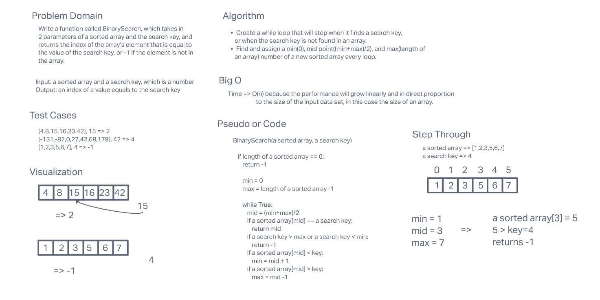

# Binary Search of Sorted Array

Write a function that returns the index of an array, which was taken as a parameter
that contains the same number as the search key, which is taken as a parameter. If it
is not included in the array, it returns -1.

## Whiteboard Process

## Approach & Efficiency

I thought about getting minimun, midpoint, and maximum number of an array, but in this
case, I used an index since we are looking for index to return from the function.
