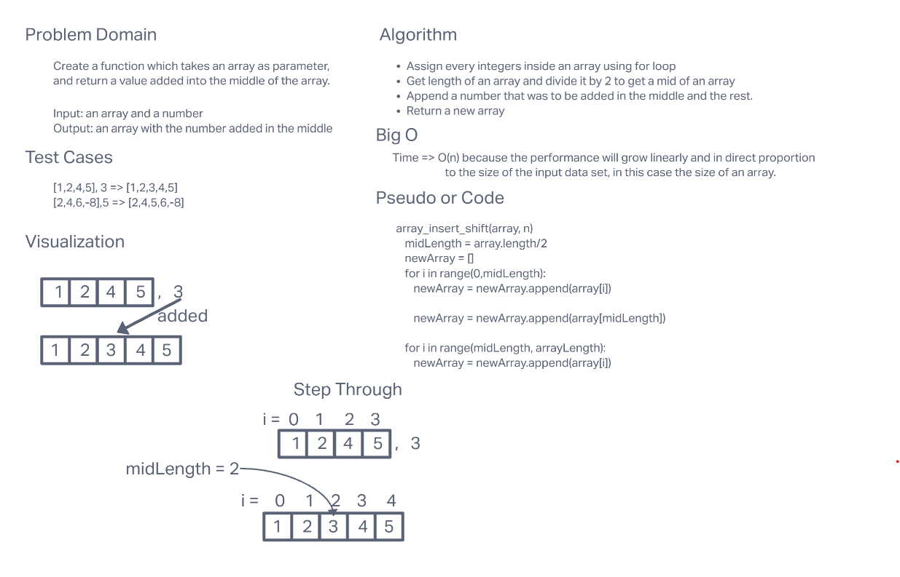

# Array Insert Shift

Writing a function that takes in an array and a number as parameter,
and put the number in the middle of an array, and returns it.

## Whiteboard Process

## Approach & Efficiency

Assigning every number with for loop and put the number that
was taken as a parameter in the middle of the array by getting the
mid-point of the array by dividing an array length by 2.
