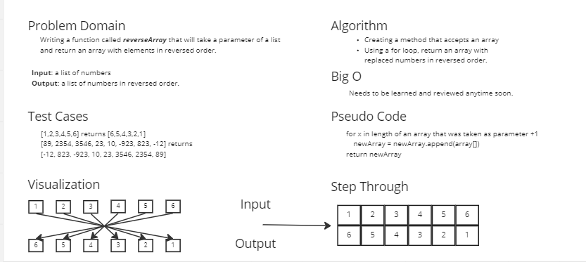

# Reverse an Array

Writing a function called reverseArray that will take a parameter of a list
and return an array with elements in reversed order.

## Whiteboard Process

## Approach & Efficiency

I thought using a for loop would help this function to make the order in reversed
 by assigning all numbers and replace them in a new array.
