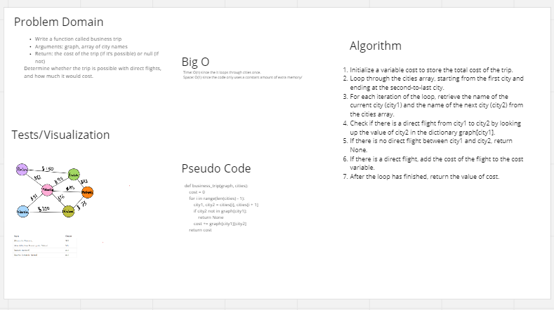

# Challenge Summary

Write a function called business trip

- Arguments: graph, array of city names
- Return: the cost of the trip (if it’s possible) or null (if not)

- Determine whether the trip is possible with direct flights, and how much it would cost.

## Whiteboard Process

## Approach & Efficiency

***BigO***
- Time: O(n)
- Space: O(1)

## Solution

- pip install pytest
- checked all tests passed

[code](../../code_challenges/graph_business_trip.py)
[test](../../tests/code_challenges/test_graph_business_trip.py)
