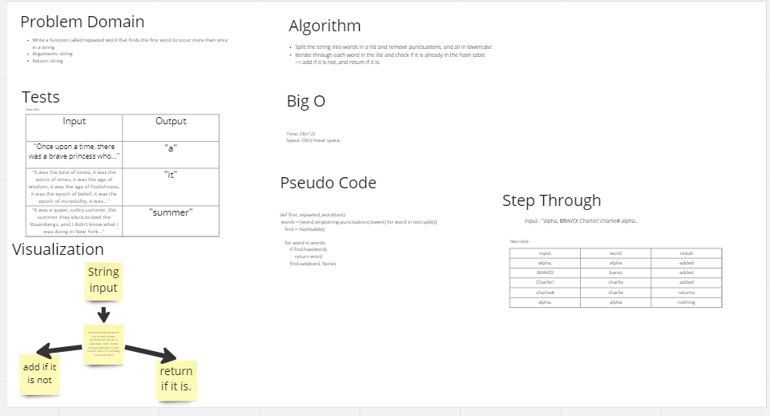

# Challenge Summary

- Write a function called repeated word that finds the first word to occur more than once in a string
- Arguments: string
- Return: string

## Whiteboard Process

## Approach & Efficiency

***BigO***
- Time: O(n^2)
- Space: O(n)

## Solution

- pip install pytest
- all tests passed

