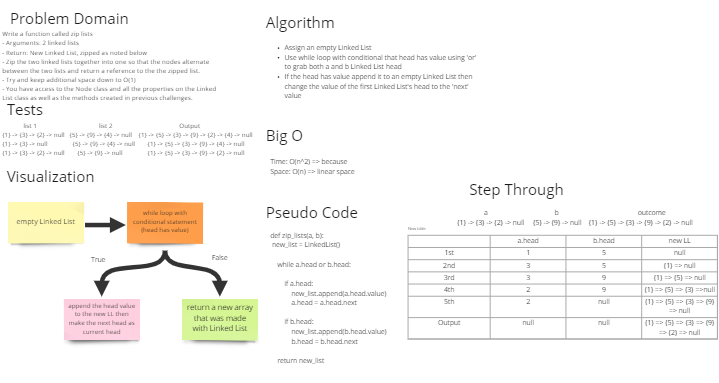

# Challenge Summary

- Write a function called zip lists
- Arguments: 2 linked lists
- Return: New Linked List, zipped as noted below
- Zip the two linked lists together into one so that the nodes alternate between the two lists and return a reference to the the zipped list.
- Try and keep additional space down to O(1)
- You have access to the Node class and all the properties on the Linked List class as well as the methods created in previous challenges.

## Whiteboard Process

## Approach & Efficiency

- Assign an empty Linked List
- Use while loop with conditional that head has value using 'or' to grab both a and b Linked List head
- If the head has value append it to an empty Linked List then change the value of the first Linked List's head to the 'next' value

## Solution

Installed and used pytest.
- All tests have passed.

