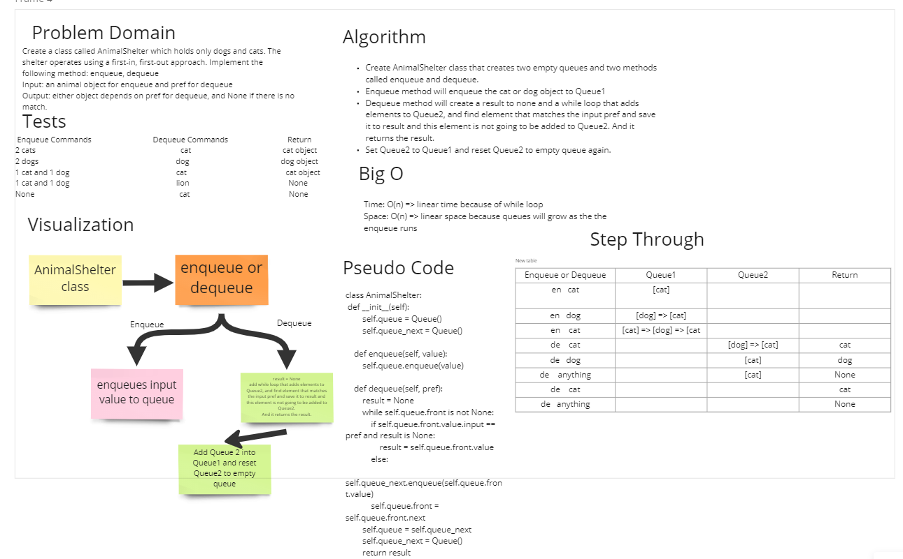

# Challenge Summary

- Create a class called AnimalShelter which holds only dogs and cats.
- The shelter operates using a first-in, first-out approach.
- Implement the following methods:

***enqueue***
- Arguments: animal
- animal can be either a dog or a cat object.

***dequeue***
- Arguments: pref
- pref can be either "dog" or "cat"
- Return: either a dog or a cat, based on preference.
- If pref is not "dog" or "cat" then return null.

## Whiteboard Process

## Approach & Efficiency

- Create AnimalShelter class that creates two empty queues and two methods called enqueue and dequeue.
- Enqueue method will enqueue the cat or dog object to Queue1
- Dequeue method will create a result to none and a while loop that adds elements to Queue2, and find element that matches the input pref and save it to result and this element is not going to be added to Queue2. And it returns the result.
- Set Queue2 to Queue1 and reset Queue2 to empty queue again.

## Solution

Installed and used pytest.
- All tests have passed.

