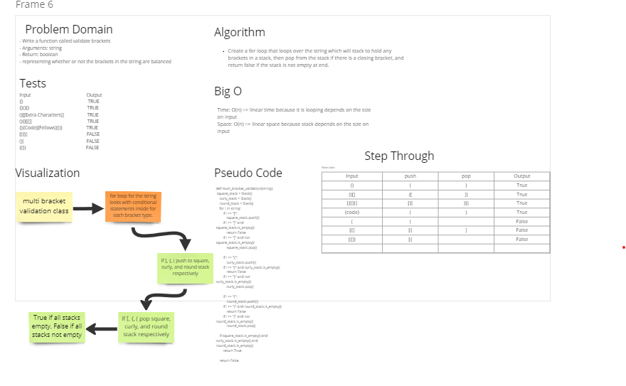

# Challenge Summary

- Write a function called validate brackets
- Arguments: string
- Return: boolean
- representing whether or not the brackets in the string are balanced

## Whiteboard Process

## Approach & Efficiency

- Create a for loop that loops over the string which will stack to hold any brackets in a stack, then pop from the stack if there is a closing bracket, and return false if the stack is not empty at end.

## Solution

Installed and used pytest.
- All tests have passed.

