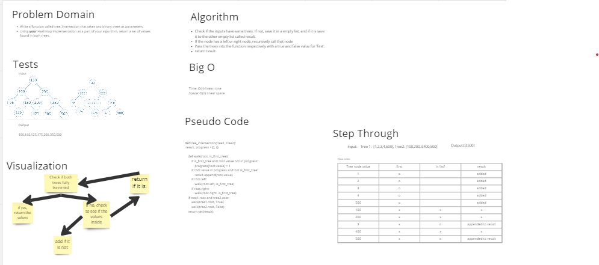

# Challenge Summary

- Write a function called tree_intersection that takes two binary trees as parameters.
- Using your Hashmap implementation as a part of your algorithm, return a set of values found in both trees.

## Whiteboard Process

## Approach & Efficiency

***BigO***
- Time: O(n) linear time
- Space: O(n) linear space

## Solution

- pip install pytest
- checked all tests passed
