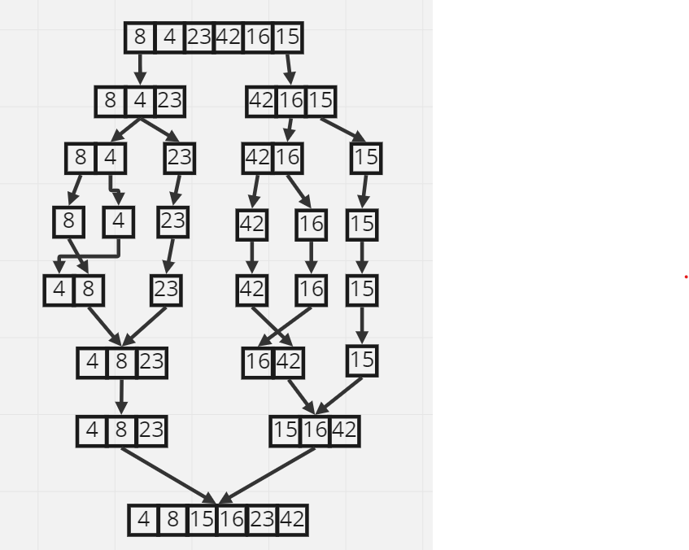

# Blog Notes: Merge Sort

### Algorithm

- The merge sort algorithm divides the input list into two equal-sized sublists, recursively sorts each sublist, and then merges the sublists together in a sorted order.
- The merge_sort function takes in a list as its parameter and assigns the length of the list to a variable n.
- If the length of the list is greater than 1, the function splits the list in half by finding the middle index (mid = n//2) and creating two new lists: left and right. The left list contains the elements from the start of the original list up to the middle index, and the right list contains the elements from the middle index to the end of the original list.
- The merge_sort() function then recursively calls itself on both the left and right lists, in order to sort them individually.
- Once the left and right lists are sorted, the merge() function is called to merge the two lists back together in a sorted order. The merge function takes in 3 parameters left, right, arr and returns the final sorted array.

### Visualization

### Big O

- Space: O(n)
- Time: O(n log (n))

### Code and tests

- 
- 
